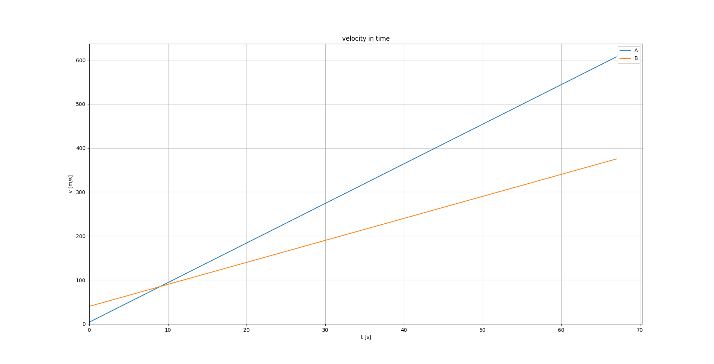
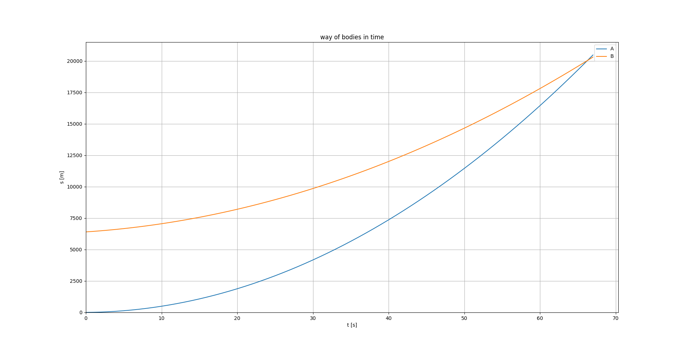
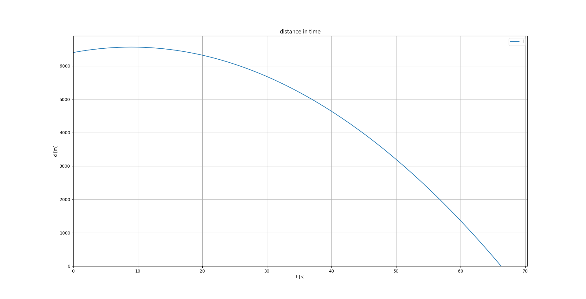

# Chart printer

Program for printing charts for "chase problem".






## How to run

The easiest way to launch the program is to run the chart_printer.exe file.

Or you can use [pip](https://pip.pypa.io/en/stable/) to install all required packages, and then run it in python:

```bash
pip install -r requirements.txt 
python ./chart_printer.py
```


## Contributing
Pull requests are welcome. For major changes, please open an issue first to discuss what you would like to change.


## Authors
[jeli-t](https://github.com/jeli-t)


## License
[MIT](https://github.com/jeli-t/chart_printer/blob/master/LICENSE)
